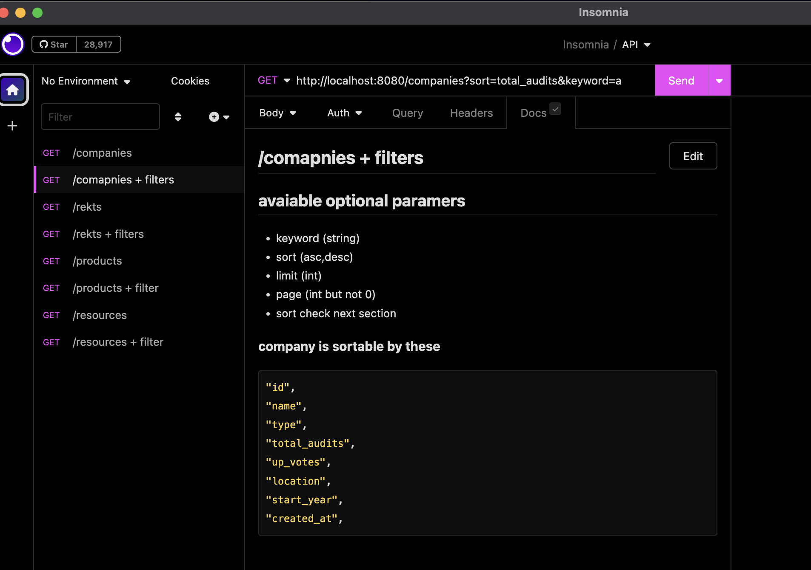

## API for sec3hub.xyz

a standalone api, aggregate cleaned data to sec3hub.xyz frontend might become a api server for other projects and friends in the future.


## Backgroud : 

at darkgrove we feel adventurous so we are going to try deno and fly , neon for this project. lets see how it goes.

##  Tech stack

- deno
  - pleasent developer experience
- oak 
  - web framework
- postgresjs
  - postgres client
- fly
  docker based serverless 
- neon
    Serverless Postgres 

## Setup
for local dev can create a .env file in the root directory. for production use process env variables.


install deno
    
```bash
curl -fsSL https://deno.land/x/install/install.sh | sh
```

or via homebrew

```bash
brew install deno
```

there are two tasks for deno test and dev

```bash
deno task dev
```

```bash
deno task test
```

via docker

```bash
docker build .  -t sec3back
```

```bash
docker run -it -p 8080:8080 sec3back
```

or with rm and detach

```bash
docker run -it -p 8080:8080 -d --rm sec3back
```

## Deploy

```bash
flyctl deploy
```


### API Docs 
there is insomia file in the root directory for testing the api. no fancy swagger docs yet.




Note endpoints return two headers

x-keyword-count	 total number of searched keyword in the database
x-row-count	  total number of rows returned from the database
